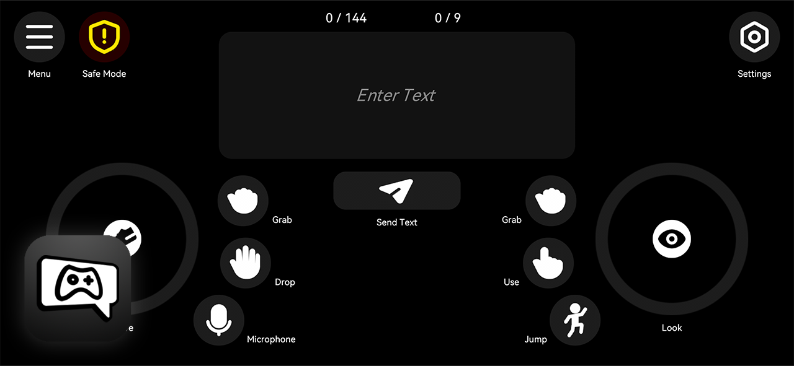

<a href="README.md">English</a> | <a href="README_zh.md">简体中文</a> | <a href="README_ja.md">日本語</a>

> [!WARNING]
> This document may contain machine-translated content. Some translations may be inaccurate.

# VRC Control Hub

**VRC Control Hub** is a **VRChat mobile controller** developed with **Unity**, based on the **OSC protocol**.
The target platform is **Android 10 and above**.

This application allows users to send OSC inputs to VRChat from their mobile devices, enabling basic control and interaction.

## Download

The prebuilt APK file **`VRCControlHub.apk`** is located in the repository’s **`Release`** folder.

Download steps:

1. Open the `Release` folder
2. Select `VRCControlHub.apk`
3. Click **Download raw file** to download it

## Planned Features (TODO)

* [ ] Switch Standing / Sitting / Prone poses (requires corresponding OSC parameters provided by VRChat)
* [ ] Simulate mouse interaction with world UI (requires corresponding OSC parameters provided by VRChat)
* [ ] Review and improve **English localization**
* [ ] Review and improve **Japanese localization**
* [x] ~~Update the application icon to match the VRChat style~~

## License

VRC Control Hub is licensed under the **Apache License 2.0**.

You are free to use, modify, and distribute this project in compliance with the terms of the license.

## Third-Party Assets

### **MingCute Icons**

- https://github.com/mingcute-design/mingcute-icons
- Copyright © MingCute
- License: Apache License 2.0
- License file: `Assets/Icon/LICENSE`

### **HarmonyOS Sans**

- https://developer.huawei.com/consumer/cn/design/resource-V1
- Copyright © 2021 Huawei Device Co., Ltd.
- License: HarmonyOS Sans Fonts License Agreement
- License file: `Assets/Font/HarmonyOS_Sans/LICENSE.txt`

### **OpenMoji**

- https://github.com/hfg-gmuend/openmoji
- Copyright © OpenMoji
- License: CC-BY-SA-4.0 license
- License file: `Assets/Font/OpenMoji/LICENSE.txt`