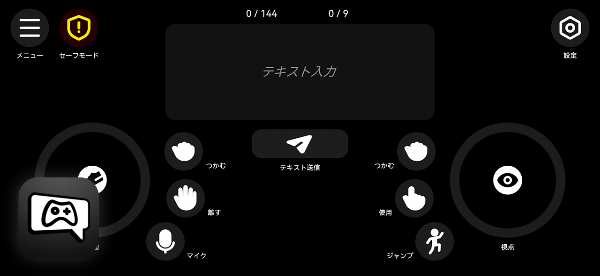

<a href="README.md">English</a> | <a href="README_zh.md">简体中文</a> | <a href="README_ja.md">日本語</a>

> [!WARNING]
> このドキュメントには機械翻訳された内容が含まれる場合があります。翻訳が不正確な可能性があります。

# VRC Control Hub

**VRC Control Hub** は、**OSC プロトコル**を基盤として **Unity** で開発された **VRChat 用モバイルコントローラー**です。  
対象プラットフォームは **Android 10 以上**です。

このアプリケーションを使用すると、スマートフォンから VRChat に OSC 入力を送信し、基本的な操作やインタラクションを行うことができます。

## ダウンロード

ビルド済み APK ファイル **`VRCControlHub.apk`** は、リポジトリ内の **`Release`** フォルダにあります。

ダウンロード方法：

1. `Release` フォルダを開く
2. `VRCControlHub.apk` を選択
3. **Download raw file** をクリックするとダウンロードできます

## 予定機能（TODO）

* [ ] 立ち / 座り / うつ伏せ 切り替え（VRChat 側で対応する OSC パラメータの提供が必要）
* [ ] マウス操作のエミュレーションによるワールド UI とのインタラクション（VRChat 側で対応する OSC パラメータの提供が必要）
* [ ] **英語ローカライズ** の校正と最適化
* [ ] **日本語ローカライズ** の校正と最適化
* [x] ~~アプリアイコンを更新し、VRChat のスタイルに合わせる~~

## ライセンス

VRC Control Hub は **Apache License 2.0** の下で公開されています。

このライセンスの条件に従う限り、本プロジェクトを自由に使用、改変、再配布することができます。

## サードパーティーアセット

### **MingCute Icons**

- https://github.com/mingcute-design/mingcute-icons
- Copyright © MingCute
- ライセンス：Apache License 2.0
- ライセンスファイル：`Assets/Icon/LICENSE`

### **HarmonyOS Sans**

- https://developer.huawei.com/consumer/cn/design/resource-V1
- Copyright © 2021 Huawei Device Co., Ltd.
- ライセンス：HarmonyOS Sans Fonts License Agreement
- ライセンスファイル：`Assets/Font/HarmonyOS_Sans/LICENSE.txt`

### **OpenMoji**

- https://github.com/hfg-gmuend/openmoji
- Copyright © OpenMoji
- ライセンス：CC-BY-SA-4.0 license
- ライセンスファイル：`Assets/Font/OpenMoji/LICENSE.txt`