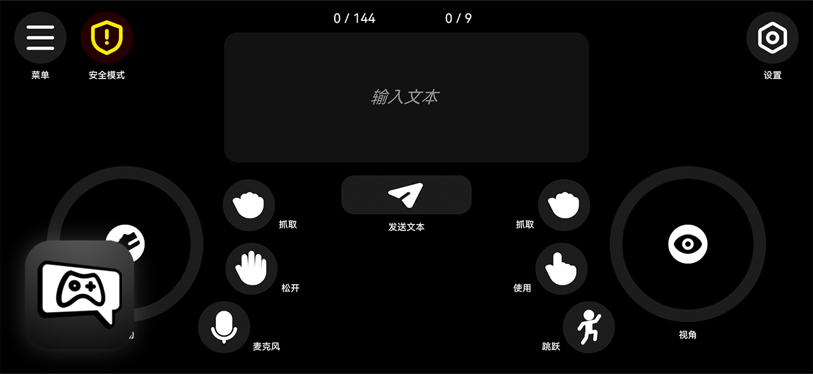

# VRC Control Hub

**VRC Control Hub** 是一个基于 **OSC 协议**、使用 **Unity** 开发的 **VRChat 移动控制器**。
目标平台为 **Android 10 及以上版本**。

该应用允许用户通过手机向 VRChat 发送 OSC 输入，从而实现基础的控制与交互。

## 下载

已构建的 APK 文件 **`VRCControlHub.apk`** 位于仓库的 **`Release`** 文件夹中。

下载方式：

1. 打开 `Release` 文件夹
2. 选择 `VRCControlHub.apk`
3. 点击 **Download raw file** 即可下载

## 计划功能（TODO）

* [ ] 站立 / 坐姿 / 趴姿 切换 （需要 VRChat 提供对应的 OSC 参数接口）
* [ ] 模拟鼠标与世界 UI 交互 （需要 VRChat 提供对应的 OSC 参数接口）
* [ ] 校对并优化 **英文本地化**
* [ ] 校对并优化 **日文本地化**
* [x] ~~更新软件图标，匹配 VRChat 风格~~

## 许可证

VRC Control Hub 采用 **Apache License 2.0** 开源协议。

在遵守该许可证条款的前提下，你可以自由使用、修改和分发本项目。

## 第三方资产

### **MingCute Icons**

- https://github.com/mingcute-design/mingcute-icons
- Copyright © MingCute
- 协议：Apache License 2.0
- 许可证文件：`Assets/Icon/LICENSE`

### **HarmonyOS Sans**

- https://developer.huawei.com/consumer/cn/design/resource-V1
- Copyright © 2021 Huawei Device Co., Ltd.
- 协议：HarmonyOS Sans Fonts License Agreement
- 许可证文件：`Assets/Font/HarmonyOS_Sans/LICENSE.txt`

### **OpenMoji**

- https://github.com/hfg-gmuend/openmoji
- Copyright © OpenMoji
- 协议：CC-BY-SA-4.0 license
- 许可证文件：`Assets/Font/OpenMoji/LICENSE.txt`